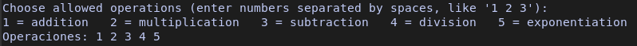
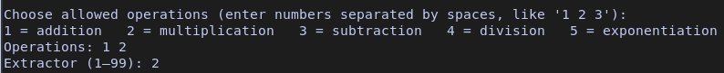
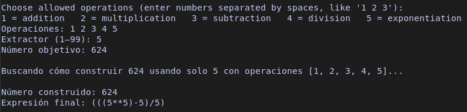

# BeltmaticSolver

This is simple, the script tells you to select which operations you want to perform, using numbers.

If you select a one number you need place a space between the other number like "1 2 3".

Next, the script asks which extractor you want to use, this means you can select a only one number to make your final number, thats i mean:

Por ultimo te pide el numero objetivo, que es el numero al que quieres llegar, por ejemplo "624", luego da una respuesta de el calculo que debes de hacer para ello.

# How To Use

After finish, u get anything like (3+(3*(3+(3+(3*3))))) and u say WRF, if you dont jnow what u need give this operation to ChatGpt.

# Requirements

El script utiliza memoria RAM para almacenar datos de las operaciones, intente optimizar el uso de la RAM pero en la primera version no pude.

Contra mas alto sea el numero objetivo "el numero final" mayor sera el consumo de RAM "en el 99% de casos"

Extractores de numeros como el "1 2 5 10" sin complicacion.

Extractores de numeros como el "7 8 9 11..." mayor dificultad de el calculo.

Numero fianl redondeado como el "10000" "100000" "10000000" aunque sea un numero grande no es un numero complejo.

Numero final complejos como "567287 987245 1236783" normalmente consume toda la ram, un "10%" de las veces consigue no consumira entera y conseguir el objetivo.

En resumen, cuidados con numeros muy grandes y complejos, si se acaba la RAM podrias perder datos utiles, antes de que se acabe la RAM deten el script.
