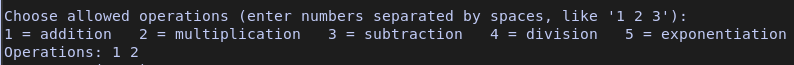
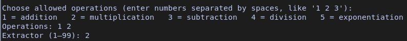
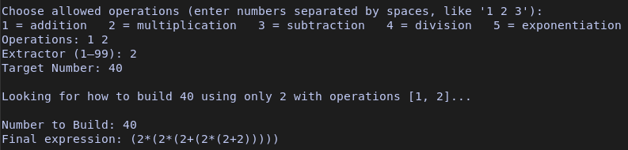
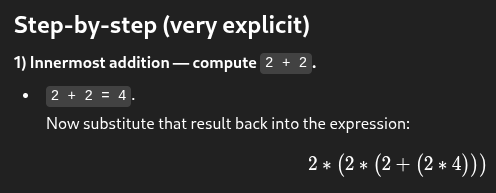

# Important

First of all, don't use impossible numbers, for example, by adding and multiplying 3s you're not going to get a 34.

First, unlock the subtractors and divisions to avoid these problems.

Control-C to script if dont stop after 3-5s.

Partially built using AI tools like Copilot, inside VSCode.

# Install BeltmaticSolver

What System u have?

if system == "Linux":
   
    chmod +x BeltmaticSolver

    
    ./BeltmaticSolver

else if system == "Windows":

   Just double click the .exe file

# Use BeltmaticSolver

This is simple, the script tells you to select which operations you want to perform, using numbers.

If you select a one number you need place a space between the other number like "1 2 3".

Next, the script asks which extractor you want to use, this means you can select a only one number to make your final number, thats i mean:

Finally, it asks for the target number, the number you want to reach, for example "40", and then it gives you the calculation you need to perform to get there.

# How To Use

After finish, u get anything like (2*(2*(2+(2*(2+2))))) and u say WTF, if you dont know what u need give this operation to ChatGpt.

 ChatGPT Foto.

Next only go to the game, and take your extractor, next place belts and start the operations like this:

# Requirements

The script uses RAM to store the data from the operations, I tried to optimize the RAM usage but in the first version I couldn’t.

The higher the target number "the final number", the more RAM it will use "like 99% of the time".

Number extractors like "1 2 5 10", no problem.

Number extractors like "7 8 9 11..." more difficult to calculate.

Rounded final numbers like "10000", "100000", "10000000", even if they are big, they are not complex numbers.

Complex final numbers like "567287", "987245", "1236783", normally they eat all the RAM, maybe like "10%" of the time it gets lucky and doesn’t use it all and reaches the goal.

So yeah, be careful with very big and complex numbers, if the RAM runs out you could lose useful data, better stop the script before that happens.

But i added a 10 seconds timeout, after it the script stop with error.
